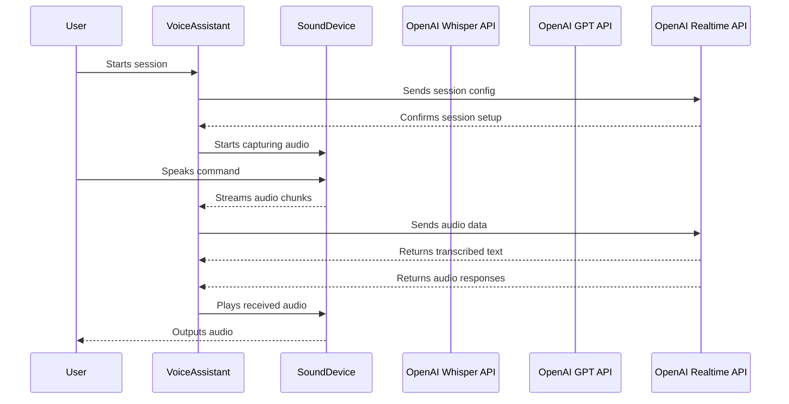

```mermaid
sequenceDiagram
    participant User
    participant VoiceAssistant
    participant SoundDevice
    participant WhisperAPI as OpenAI Whisper API
    participant GptAPI as OpenAI GPT API
    participant WebSocketAPI as OpenAI Realtime API

    User->>VoiceAssistant: Starts session
    VoiceAssistant->>WebSocketAPI: Sends session config
    WebSocketAPI-->>VoiceAssistant: Confirms session setup
    VoiceAssistant->>SoundDevice: Starts capturing audio
    User->>SoundDevice: Speaks command
    SoundDevice-->>VoiceAssistant: Streams audio chunks
    VoiceAssistant->>WebSocketAPI: Sends audio data
    WebSocketAPI-->>VoiceAssistant: Returns transcribed text
    WebSocketAPI-->>VoiceAssistant: Returns audio responses
    VoiceAssistant->>SoundDevice: Plays received audio
    SoundDevice-->>User: Outputs audio
```
