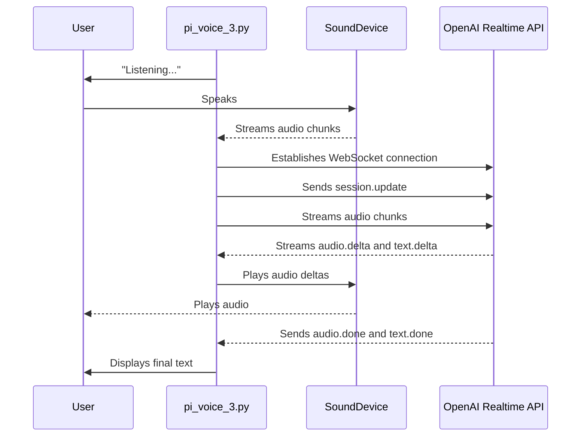

```mermaid
sequenceDiagram
    participant User
    participant PiVoice3 as pi_voice_3.py
    participant SoundDevice
    participant RealtimeAPI as OpenAI Realtime API

    PiVoice3->>User: "Listening..."
    User->>SoundDevice: Speaks
    SoundDevice-->>PiVoice3: Streams audio chunks
    PiVoice3->>RealtimeAPI: Establishes WebSocket connection
    PiVoice3->>RealtimeAPI: Sends session.update
    PiVoice3->>RealtimeAPI: Streams audio chunks
    RealtimeAPI-->>PiVoice3: Streams audio.delta and text.delta
    PiVoice3->>SoundDevice: Plays audio deltas
    SoundDevice-->>User: Plays audio
    RealtimeAPI-->>PiVoice3: Sends audio.done and text.done
    PiVoice3->>User: Displays final text
```
